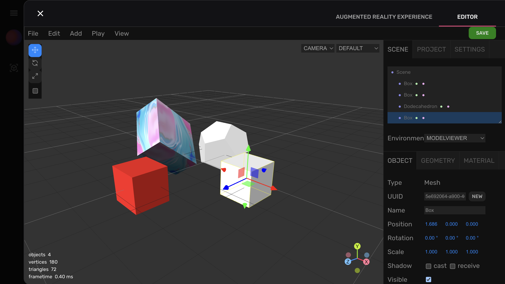
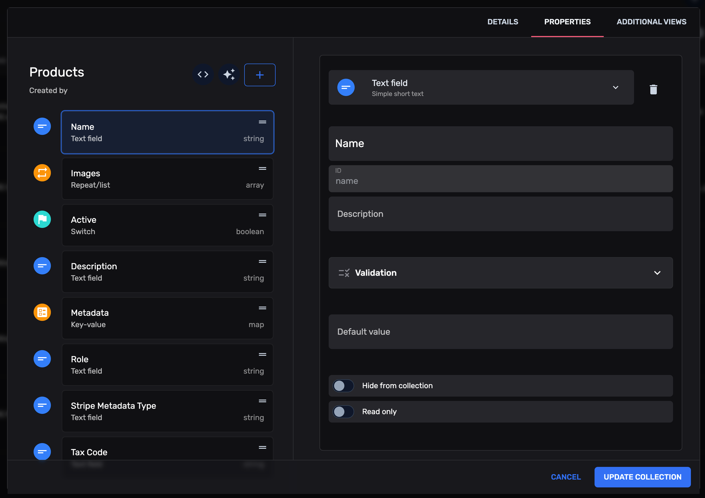
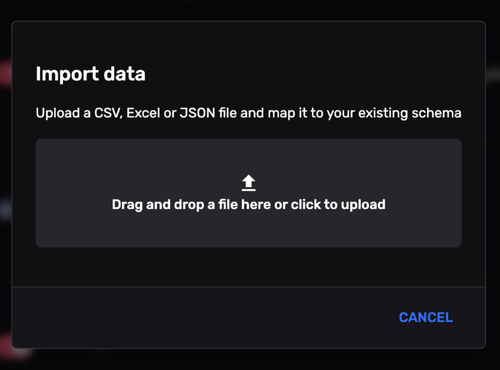

> ### We are giving away to our community a free a month of FireCMS Cloud Plus with the code **`IMONFIRE`**.

## FireCMS 3.0 The Next CMS that is already here.🔥

Three years ago we launched the first version of FireCMS. We started offering an open source core so that anyone could
build whatever they need. FireCMS started as an internal tool that we offered to our clients. The usual use case is: you
are building an app or a web using Firebase as a backend, and need a backoffice tool to manage your data, your users,
your files. Everything in a secure environment and with a strong roles and permissions system. Along the years, we have
developed full stack solutions for partners like
as [Oikosbrain](https://oikosbrain.com/), [medicalmotion](https://medicalmotion.com/en)
or [ThePlanetApp](https://theplanetapp.com/?lang=en). Likewise, many agencies have benefited from the open-source nature
of the project and use it to develop internal apps for their own clients. Since it’s inception, FireCMS has been
downloaded 200k+ times in NPM.

Along the years we understood that we need to make it simple for the customer to install and configure FireCMS, but also
keep the power of using code to extend the base product with any feature. We helped customers build extensions for other
database providers, such as MongoDB, or create a 3D model editor using Three.js. And that’s our focus for the next
years: Build the best no-code CMS, while preserving all the customization options in code, and ease of use our users
love.

## Today we launch the Beta version of FireCMS 3

We have put a lot of effort into building a hosted version of the collection editor, including most of the customization
an validation oprions. We provide a great UI, and you extend it however you need.

<video class="demo" loop autoPlay muted>
    <source src="/img/blog/demo_books_llm.webm" type="video/mp4"/>
</video>

### ☁️ The Cloud Version

One of the most significant additions to FireCMS 3.0 is the introduction of the SaaS cloud-hosted version. This new
offering allows users to easily access and manage their FireCMS projects directly from the cloud. With this feature,
users no longer need to worry about setting up and maintaining their own infrastructure, as FireCMS takes care of it
all. This greatly simplifies the deployment process and allows end users to focus more on building their applications.

You no longer need to manually update CMS versions since every update is pushed to the cloud and received by all
clients.

### 🔑 The customers still own the data

Your data is yours, we don’t need to access it. Each FireCMS project is linked to a Firebase project, that is owned by
you, the customer. We just provide the interface to manage the data. If you need, we also help you creating and
configuring the Google Cloud project and the Firebase project. We can help you with the process. Starting now.

### 🧑‍💻 Customization with Code

With FireCMS 3.0, customization options have been taken to the next level. Now, users can leverage the power of code to
personalize their CMS even further. Whether it's tweaking the layout, adding custom fields, or implementing complex
business logic, developers have the flexibility to extend and modify FireCMS to suit their specific needs. This level of
customization empowers users to create truly unique and tailored CMS experiences. We even built
a [CLI](https://firecms.co/docs/deployment##firecms-cli) for that. Start the project, write the code, upload it and find
the features in
the [app](https://www.notion.so/Beta-Launch-FireCMS-3-0-Cloud-and-Cloud-Plus-c99f446121614ae5bb832e8123ef071c?pvs=21).
Extend the React basecode with Typescript or Javascript.

> An example of highly customized instance of FireCMS, with the ThreeJS editor integrated

We have also built a [CLI](https://firecms.co/docs/deployment##firecms-cli) for making the interaction with the Cloud
easier. Start the project, write the code, upload it and find the features in
the [app](https://www.notion.so/Beta-Launch-FireCMS-3-0-Cloud-and-Cloud-Plus-c99f446121614ae5bb832e8123ef071c?pvs=21).
Extend the React base code with Typescript or Javascript.

And just deploy with one command:

`firecms deploy`

### New UI collection schema editor

Originally, collections were only defined in code. Now, you can do it with a UI as well. Add fields, add collections,
property types, files, images. All the properties, now they can be configured with a few clicks. If you need to add some
logic to your collections, like enabling some fields based on other values, you can get the code for your current
collection

But it gets even better! FireCMS can automatically detect new values and add them to the schema with just a single
click. This empowers users to easily customize and adapt their collection schemas to meet their evolving needs.

Even though the collection schema is now stored in the backend, you still maintain full control over which properties
can be modified from the user interface. Moreover, you have the ability to define default values for new documents,
ensuring consistency and efficiency in data management.

### New data inference

Do you have a few collections in your project and want to get started quickly? FireCMS can now **infer the schema from
your data**. This means that you can begin using FireCMS in just a few minutes, without the need to write a single line
of code. Simply import a data file and start immediately.

### 💽 Data import and export

Now, you can import and export the data. As we've stated, you are the owner of the data and it's up to you to decide.

#### Import

You can now import data from CSV, JSON, or Excel files. This feature is excellent for migrating data from other systems.
We have incorporated a modern UI that enables you to define how the data is imported and how it is mapped to your
collections.

#### Export

You now have better control over how your data is **exported**:

- Define the format of your timestamps.
- Define how arrays are serialized in CSV files (assigning one column per array item, or serializing the array as a
  string).
- Export your data as JSON or CSV.

### 🤖 GPT-4 Content Generation

We have improved our interface to enable content generation. You can create a complete database row from a prompt, a
title, or any available field. We also provide a UI to perform various actions such as summarizing, translating, and
expanding. Whatever you can think of is ready to use. We use GPT-4 under the hood.

### 🚤 Performance improvements

Versions 1.0 and 2.0 of FireCMS were based on Material UI (mui). This was great for getting started quickly, but it had
some drawbacks. The main one was that performance was not great. The styling solution of MUI is based on emotion which
resolves styles at runtime. This means that the browser has to do a lot of work to resolve the styles. This is not a
problem for small applications, but it can be a problem for large applications.

In FireCMS 3.0, we have migrated to Tailwind CSS. This is a utility-first CSS framework that allows us to generate a
small CSS file with all the styles resolved at build time. This means that the browser does not have to do any work to
resolve the styles, which results in a much faster experience. 🚀

### 👥 Roles and permissions

Now you can leverage out of the box invitations, user management, and a role system. The default ones, Viewer, Editor,
or Admin, or create your own custom ones.

### 🔍 Local text search

Search out of the box. No need to create an index or to rely on a third-party provider, type and find your records. We
look through all the fields and perform a smart search. Just click on search and start typing.

### 🎨 New components library, theming and better icons

In FireCMS 3.0, components, icons and colors have received a significant upgrade.

We have built a full component library

The new release includes an expanded set of icons, giving users more options to choose from when designing their CMS.
Additionally, the color palette has been expanded, allowing for greater flexibility in creating visually appealing
interfaces. These enhancements enable developers to create stunning and intuitive CMS designs that align with their
brand and aesthetic preferences.

### Pricing

We decided to provide a free tier of use of the CMS. **FireCMS Cloud Free**. This is everything you have in the Free
version:

- Unlimited projects
- Unlimited collections
- All available form fields
- Schema editor and inference from data
- Advanced data import and export
- Default roles
- 3 users

Regarding the premium option, we called it **FireCMS Cloud Plus**, and this is everything it comes with (for now):

- Everything in the free tier
- Local text search
- Custom fields and custom views
- Unlimited users and roles
- Unlimited data export
- Theme and logo customization
- Customization with Code
- Custom user roles
- GPT-4 content generation

While the free plan is, well, free, the Plus is 9,99€ per customer per month. We are continuously going to add features,
provide support, and a live web app where you can find your projects.

### How to start?

Go to [app.firecms.co](http://app.firecms.co/) and get started.

We are giving away a free month of Plus customers to everyone using the code **IMONFIRE** at the checkout.

### What are you going to build?

We want to hear about it :) Find us
on [Discord](https://discord.gg/fxy7xsQm3m), [LinkedIn](https://www.linkedin.com/company/firecms/?originalSubdomain=es),
or ping us at [hello@firecms.co](mailto:hello@firecms.co)
