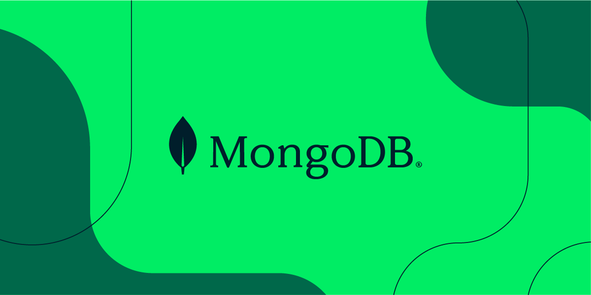

## Say Hi to MongoDB!

For FireCMS users, connecting to MongoDB just got a lot easier. While **FireCMS** has always offered the **flexibility** to integrate with various databases, we're thrilled to announce a dedicated package for seamless MongoDB integration.

How easy? **npm** easy `npm install @firecms/mongodb`, or **yarn** easy `yarn add @firecms/mongodb`.

This is part of our efforts to bring all the power of FireCMS with the [PRO](https://firecms.co/pro) version. The most advanced and flexible version of FireCMS.

### Why MongoDB?

Choosing the right database is crucial, and MongoDB, especially when paired with its cloud counterpart Atlas, presents a compelling option for many projects. Its document-oriented structure aligns well with how we often model data, and its performance and scalability make it suitable for projects of all sizes.

### Same FireCMS Experience, Now Powered by MongoDB

We implemented the necessary **utilities** to connect and consume Atlas MongoDB **database** and **authentication** services.

<!-- truncate -->

So that means that you can use **all the features already available** in FireCMS. From the collection editor to the LLM based content generation, you can use all of them.

As you may already know, MongoDB Atlas doesn't provide a Storage service, such as [AWS S3](https://aws.amazon.com/s3/) or [Firebase Storage](https://firebase.google.com/docs/storage). But no worry, you can fill the gap with FireCMS's extensibility. You're free to integrate any storage solution you prefer, take inspiration from our [Custom Storage Documentation](https://firecms.co/docs/pro/custom_storage) which details the interface and a sample for an AWS S3 integration.


### Only MongoDB?

While this announcement focuses on MongoDB, it's crucial to remember that FireCMS's core is database agnostic. The power lies in its adaptability. You can build custom Data Source integrations, connecting FireCMS to everything from traditional SQL databases like Postgres to lightweight options like SQLite.

### How to get started?

We recommend you take a look ath the documentation regarding [FireCMS Controller](https://firecms.co/docs/pro/Controllers). We also dropped an example in our Github: [FireCMS MongoDB Example](https://github.com/firecmsco/firecms/blob/main/examples/example_pro/src/MongoDBApp/MongoDBApp.tsx).

But here are the steps if you want to jump on it:
 - Install the package `yarn add @firecms/mongodb` or `npm install @firecms/mongodb`
 - Add the atlas config, example:
```typescript
const atlasConfig = {
    "appId": "your_app_id",
    "appUrl": "your_app_url",
    "baseUrl": "your_base_url",
    "clientApiBaseUrl": "your_client_api_base_url",
    "dataApiBaseUrl": "your_data_api_base_url",
    "dataExplorerLink": "your_data_explorer_link",
    "dataSourceName": "mongodb-atlas"
};
 ```
 - Create a new `MongoDBController` instance and pass the atlas config:
```typescript
const { app } = useInitRealmMongodb(atlasConfig);
```
 - Init the new MongoDB hooks:
```typescript
const authController: MongoAuthController = useMongoDBAuthController({
    app
});

const cluster = "mongodb-atlas"
const database = "todo"

const mongoDataSourceDelegate = useMongoDBDelegate({
    app,
    cluster,
    database
});
``` 

And that's it. The rest of the job it's identical to any other FireCMS project.
Check the complete instruction in the [FireCMS MongoDB Documentation](https://firecms.co/docs/pro/mongodb).


### What are you going to build?

We want to hear about it :) Find us
on [Discord](https://discord.gg/fxy7xsQm3m), [LinkedIn](
https://www.linkedin.com/company/firecms/?originalSubdomain=es),
or ping us at [hello@firecms.co](mailto:hello@firecms.co)
