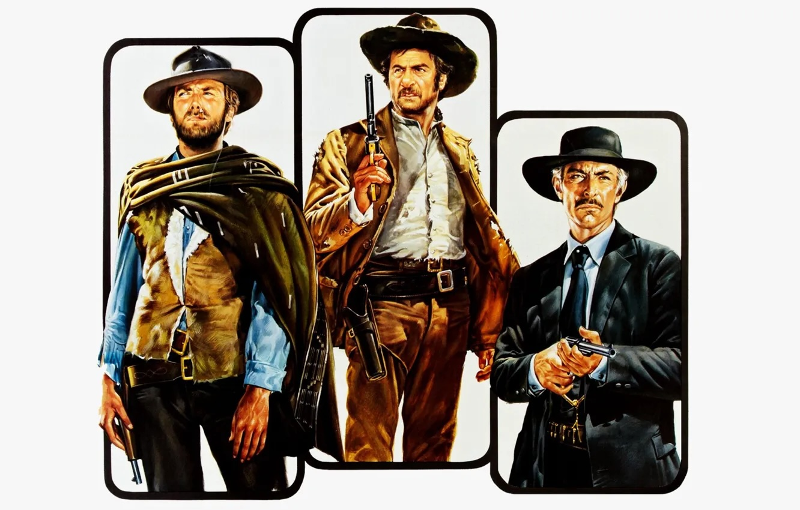
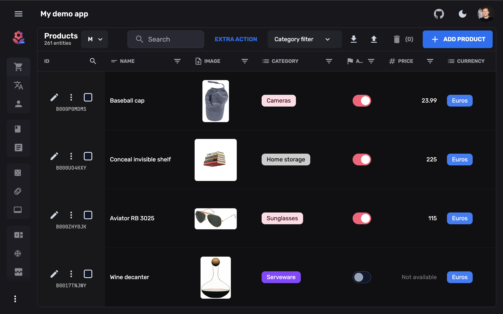

## OpenSource, The Good, the Bad, and the Ugly

Open source is a hot topic right now. Often making headlines due to high-profile conflicts like the recent [WordPress vs. WP Engine dispute](https://techcrunch.com/2023/10/20/wordpress-vs-wp-engine-drama-explained/) over plugin licensing disagreements, or [Elastic's licensing battle with AWS](https://www.thestack.technology/the-big-interview-their-product-sucked-elastic-cto-shay-banon-on-suing-aws-and-returning-to-oss/), which led to a shift to a source-available license. These incidents underscore the complex landscape of open-source development, a journey we've been navigating since our [initial commit](https://github.com/firecmsco/firecms/commit/6508f8d7db7e7ae29f493023550271be009b3b89) on GitHub in April 2020.

Since its inception, [FireCMS](https://github.com/firecmsco/firecms) has evolved from an internal tool to a widely-used open-source content management system (CMS) that helps developers build and prototype products efficiently. We want to share our experiences; the good, the bad, and the ugly of building FireCMS in public with an open-source license.

## The Good

Our journey with FireCMS began as an in-house solution to streamline our development process. Seeing it grow beyond our organization and being utilized by other projects and companies has been profoundly fulfilling. It not only helped us in building and prototyping products faster but also empowered others to do the same.

Our obsession is building the best CMS out there, focusing on creating a functional and beautiful software experience. The feedback we receive from the community is incredibly helpful. Bugs, feature requests, and sometimes even pull requeststhese contributions drive us forward.

Our stakeholders are developers in the sprints, and our QA team is the community. We prioritize features requested by even a single user because we believe in building something that genuinely helps people. While other companies have private messaging apps, we have an open [Discord](https://discord.gg/fxy7xsQm3m) server for everyone. This transparent and collaborative approach has fostered strong, organic community growth; a huge push for us. 

Watching FireCMS grow organically has been incredibly rewarding. We've always felt that we're doing something right as the community and usage expand naturally. Seeing developers embrace our project fills us with pride and motivates us immensely.

*The intuitive interface of FireCMS that our users love.*

## The Bad

Monetizing an open-source project is not easy. While we started receiving sponsorships on GitHub, it quickly became clear that it wasn't enough to sustain the project's growing demands. As we invested more time into the codebase, turning it into a full-time job, we needed to find a way to make it sustainable, because we truly love working on FireCMS.

Transitioning from a passion project to a sustainable business was tougher than we expected. We decided to build a SaaS product: a completely managed service where you bring your Firestore (or MongoDB) project, and we take care of the rest. With more features, plugins, and extensions, it offered a commercial product with a different business model. However, it's not just about having a good product; it's about selling it.

We faced resistance as users were accustomed to free access, and the number of people willing to pay for a product is tiny. We experimented with premium features and consulting services, but these options didn't fully address the sustainability challenge.

Usually, it's at this crossroads; having a lot of people using your product but few willing to pay, where open-source projects change their licenses. Companies like ElasticSearch, MongoDB, Redis, and HashiCorp have transitioned to source-available licenses after facing similar challenges.

## The Ugly

Encountering companies that clone not just our code but our entire brand identity was disheartening. Copycats, not competitors or alternative builds, but entities that copied even our landing page and branding. Not cool.

We would love to have more working hands on the project, but looking back over the past year, we've received more feature requests than pull requests. We never aspired to hold the title of [Benevolent Dictator for Life](https://en.wikipedia.org/wiki/Benevolent_dictator_for_life), so popular these days. Open source thrives on community contributions, and we hope more developers will join us in enhancing FireCMS.

## What's next?

More FireCMS, for sure. Struggles and everything, we are still obsessed in making functional and beautiful software. So check the releases, get in our [Discord](https://discord.gg/fxy7xsQm3m), start a project in [FireCMS Cloud](https://app.firecms.co/) or give us a star in [Github](https://github.com/firecmsco/firecms).  

### What are you going to build?

We want to hear about it :) Find us
on [Discord](https://discord.gg/fxy7xsQm3m), [LinkedIn](
https://www.linkedin.com/company/firecms/?originalSubdomain=es),
or ping us at [hello@firecms.co](mailto:hello@firecms.co)
